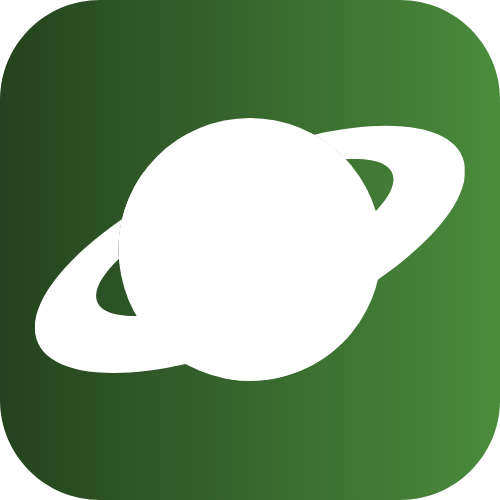

  

  <h1 align="start" style="background: linear-gradient(90deg, #FFFFFF, #B497D6); -webkit-background-clip: text; -webkit-text-fill-color: transparent;">
    Hi there, I'm Mix! 👋
  </h1>

  Beginner Developer | In learning process 🚀

---
<h2 align="start">🚀 Technologies</h2>

    

  <h2 align="start"> 🌌 Featured Project</h2>

   

  <b>Cosmos Marketplace</b> is a next-gen digital marketplace focused on immersive, cosmic-themed user experiences. It brings together futuristic design, strong performance, and secure user interaction.

---
